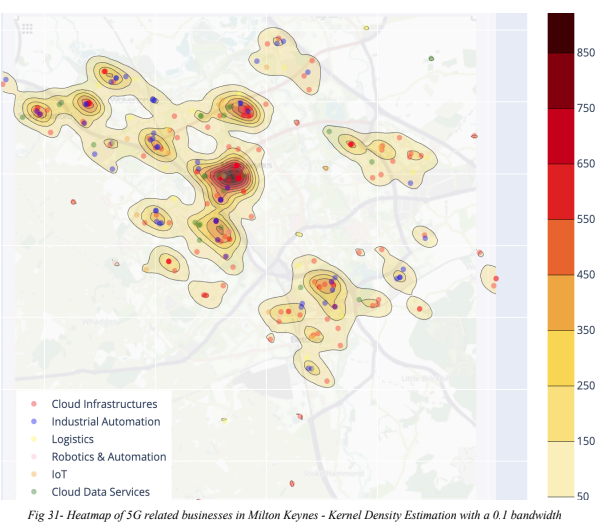

# Industrial Cluster Discovery via NLP

## Overview

Welcome to the repository for my master's thesis, **Industrial Cluster Discovery via NLP.** This project leverages Natural Language Processing (NLP) and Machine Learning (ML) techniques to analyze and cluster business activities within Milton Keynes. By extracting and analyzing textual data from company websites, we uncover valuable insights into the city's economic landscape, revealing hidden patterns and trends in industrial activities.

## Thesis Abstract

In this master's thesis, we delve into the discovery of industrial clusters in Milton Keynes by analyzing textual data from company websites. Using advanced NLP and ML techniques, we extract semantic information from the text, enabling us to perform clustering that highlights patterns and trends within the business landscape. This approach includes:

- **Data Collection**: Gathering and preprocessing web data to create a comprehensive dataset.
- **Geo-spatial Analysis**: Using Kernel Density Estimation (KDE) to map business activities and identify high-density areas.
- **NLP and ML Models**: Employing Latent Dirichlet Allocation (LDA) and BERTopic for robust topic modeling and clustering.

## Key Components

### Data Collection
- **APIs and Web Scraping**: Utilizing Companies House API, GoogleMaps API, and web scraping tools to collect and preprocess textual data from company websites.
- **Comprehensive Dataset**: Building a rich dataset that captures the diverse business activities within Milton Keynes.

### Geo-spatial Analysis
- **Density Mapping**: Creating density maps to visualize the concentration of business activities.
- **Cluster Identification**: Identifying clusters of business activities that reveal economic hotspots and potential areas for development.

### NLP and ML Models
- **Latent Dirichlet Allocation (LDA)**: Implementing LDA to extract topics and uncover underlying themes in the textual data.
- **BERTopic**: Using transformer-based clustering to enhance the accuracy and interpretability of the clusters.

### Visualization
- **Interactive Maps**: Visualizing business clusters on interactive maps, highlighting various sectors and their distribution across the city.
- **Insightful Graphics**: Providing compelling visualizations that make the findings easy to understand and explore.

## Results

### Discoveries and Insights
- **Economic Hotspots**: Identified high-density areas of business activities, highlighting key economic hotspots within Milton Keynes.
- **Sector Distribution**: Mapped the distribution of various business sectors, providing insights into the city's industrial landscape.
- **Strategic Development**: Offered valuable data-driven insights that can guide urban planning and development strategies, fostering a smarter and more efficient city.
